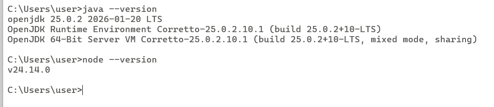

# 7CV4-MOVILES

# Integrantes:
 **Buendia Cedillo Irvin Samuel**
 **Rosario Cruz Josue Benjamin**
 **Grupo: 7CV4**

#Práctica 1: Instalación y Funcionamiento de los Entornos Móviles
Android Studio
 

GitHub Desktop
 

 

 ## 1. Descripción de las Activities (Sistema Solar)
[cite_start]Se diseñó una aplicación Android con una navegación jerárquica de 4 niveles[cite: 10, 38]:

* [cite_start]**GalaxiaActivity:** Menú principal y punto de entrada al proyecto creativo[cite: 42, 54].
* [cite_start]**SistemaSolarActivity:** Segundo nivel que muestra la disposición del sistema[cite: 42].
* [cite_start]**PlanetasActivity:** Tercer nivel con el listado interactivo de cuerpos celestes[cite: 42].
* [cite_start]**LunasActivity:** Nivel final que detalla los satélites naturales[cite: 42].

---

## 2. Transiciones y Ciclo de Vida
[cite_start]Se utilizaron **Intents explícitos** para la comunicación entre las clases de Kotlin[cite: 10, 11]. 
* [cite_start]**Transiciones:** Se aplicó `overridePendingTransition` para lograr una navegación fluida y creativa entre los niveles[cite: 10, 51].
* [cite_start]**Ciclo de Vida:** Se gestionó el estado de las Activities mediante métodos como `onCreate` para inicialización y `onResume/onPause` para el flujo de la app[cite: 11, 51].

---

## 3. Instrucciones de Ejecución
1. Clonar el repositorio: `git clone https://github.com/SamuelBC25/7CV4-MOVILES.git`.
2. [cite_start]Abrir en Android Studio con JDK Amazon Corretto[cite: 23].
3. [cite_start]Ejecutar `flutter doctor` (si aplica para los componentes de Flutter instalados) o simplemente correr el proyecto en el emulador[cite: 32, 35].

---

## 4. Evidencias

