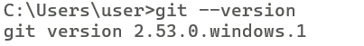
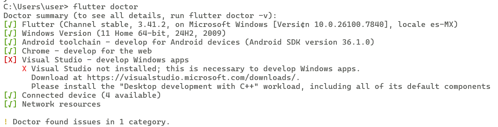
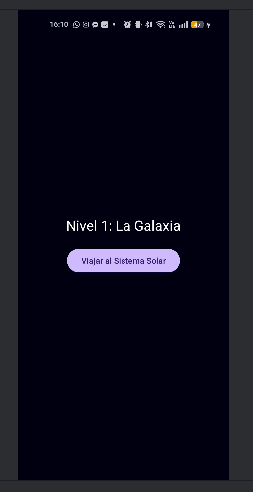

# 7CV4-MOVILES

# Integrantes:
* **Buendia Cedillo Irvin Samuel**

* **Rosario Cruz Josue Benjamin**

* **Grupo: 7CV4**

Práctica 1: Instalación y Funcionamiento de los Entornos Móviles

## Ejercicio 1: Instalación de Herramientas
Se realizó la configuración del entorno de desarrollo siguiendo los requerimientos de la práctica:
* **Android Studio:** IDE principal para el desarrollo y emulación.

Android Studio
 

* **JDK Amazon Corretto y Node.js:** Instalado y configurado en las variables de entorno para la compilación de Java/Kotlin.

 

* **Git & GitHub:** Configuración de control de versiones y repositorio remoto.

GitHub Desktop
 
Git

* **Flutter SDK:** Instalado y verificado mediante el comando `flutter doctor`.

---

## Ejercicio 2: Navegación Creativa (Sistema Solar)
Este ejercicio consiste en una aplicación desarrollada de forma **nativa con Kotlin** que utiliza una navegación jerárquica de 4 niveles.

### Descripción de las Activities
1. **GalaxiaActivity:** Menú principal y punto de entrada que representa la escala macro de la jerarquía.
2. **SistemaSolarActivity:** Segundo nivel que introduce al usuario al sistema planetario.
3. **PlanetasActivity:** Tercer nivel con un listado visual de los planetas.
4. **LunasActivity:** Nivel final que muestra el detalle de los satélites naturales.

### Transiciones y Ciclo de Vida
* **Transiciones:** Se implementaron `Intents` explícitos acompañados de `overridePendingTransition` para lograr efectos de deslizamiento y desvanecimiento, cumpliendo con el requisito de navegación fluida.
* **Ciclo de Vida:** Se gestionaron los estados de las Activities (específicamente `onCreate` y `onResume`) para optimizar el rendimiento y registrar el flujo de navegación en el Logcat.

---

## Instrucciones de Ejecución
1. Clonar el repositorio: `git clone https://github.com/SamuelBC25/7CV4-MOVILES.git`.
2. Abrir el proyecto en **Android Studio**.
3. Asegurarse de que el **JDK Amazon Corretto** esté seleccionado en la configuración del proyecto.
4. Sincronizar **Gradle** y ejecutar en un emulador Android (API 30+ recomendado).

---

## Evidencias

